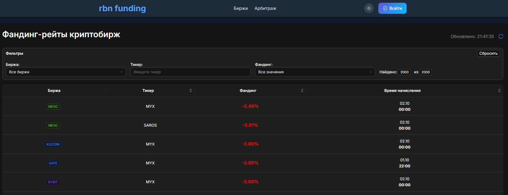

# Funding Checker 💸

Инструмент для мониторинга и анализа фандинг рейтов на криптобиржах.
Помогает быстро собирать, хранить и визуализировать данные по ставкам финансирования (funding) для различных инструментов.

## 🚀 Возможности

- Поддержка нескольких бирж

- Автоматическое сохранение funding-ставок

- Очистка и обновление данных в базе

- REST API / сервис для получения актуальных ставок

- Панель фильтров для быстрого поиска по биржам и символам

- Поиск арбитражных ситуаций для фандинга

## 📦 Технологии

**Backend:** Python (FastAPI, asyncio, PostgreSQL)

**Frontend:** React + Ant Design

**База данных:** PostgreSQL

**Прочее:** Docker

